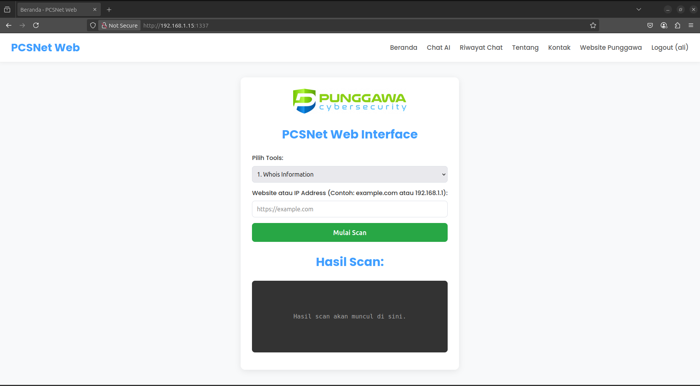
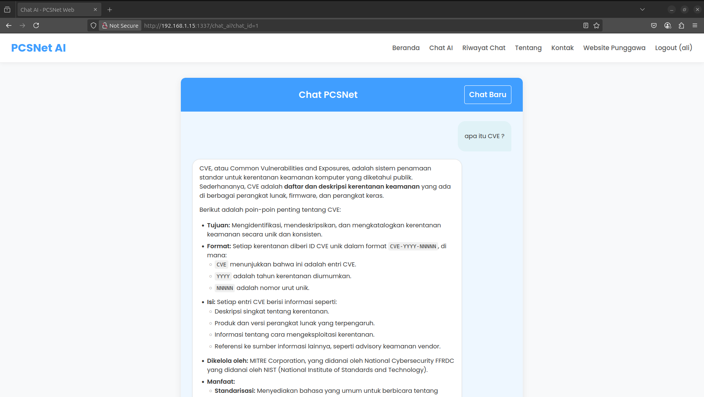

# PCSNet Security Tools Network Scanning Web Interface
PCSNet ( Punggawa Cyber Security Network Testing )

## Daftar Isi
- [Fitur](#fitur)
- [Teknologi](#teknologi)
- [Prasyarat](#prasyarat) 
- [Cara Instalasi](#cara-instalasi)
  - [Instalasi Manual](#instalasi-manual)
  - [Instalasi Docker](#instalasi-docker)
- [Cara Menjalankan Aplikasi](#cara-menjalankan-aplikasi)
- [Panduan Penggunaan](#panduan-penggunaan)
- [Screenshot](#screenshot)
- [Pengembangan Selanjutnya](#pengembangan-selanjutnya)
- [Lisensi](#lisensi)

PCSNet Security Tools Network Scanning Web Interface, menggabungkan kecerdasan chatbot Google Gemini AI dengan fitur scanning keamanan siber. Aplikasi ini dilengkapi autentikasi pengguna, riwayat percakapan pribadi, dan manajemen sesi chat yang lengkap.

## Fitur 

- **Antarmuka Tools Scanning (Beranda):** Interface web untuk menjalankan berbagai tools scanning keamanan siber (Whois, DNS Lookup, Nmap, Sublist3r, WhatWeb, SQLMap, XSpear, Slowhttptest, Traceroute, Curl).
- **Chatbot Gemini AI:** Interaksi langsung dengan model Google Gemini AI (gemini-2.0-flash default) melalui halaman "Chat AI".

## Teknologi

- Python 3.x
- Flask
- Flask-SQLAlchemy
- Google Generative AI (google-generativeai)
- SQLite
- Tools Scanning: Nmap, Whois, Dig, WhatWeb, Wafw00f, SQLMap, XSpear, Slowhttptest, Traceroute, Curl
- Docker & Docker Compose

## Prasyarat

- Python 3.x dan pip
- Sistem Operasi Debian/Ubuntu (untuk instalasi manual)
- Docker dan Docker Compose (untuk instalasi docker)

## Cara Instalasi

### Instalasi Manual

1. **Instalasi Tools Scanning**
```bash
Download file install_pcsnet_tools.sh
chmod +x install_pcsnet_tools.sh
sudo ./install_pcsnet_tools.sh
```

2. **Download Aplikasi Flask**
```bash
git clone https://github.com/KangAli/PCSNet.git
cd PCSNet
python -m venv venv
```
Aktifkan venv:
```bash
source venv/bin/activate   # Linux/macOS
venv\Scripts\activate.bat   # Windows CMD
.\venv\Scripts\Activate.ps1  # Windows PowerShell
```
Install Requirements
```bash
pip install -r requirements.txt
```

3. **Konfigurasi API Keys Manual**
```bash
export SECRET_KEY="kunci_rahasia"     # Linux/macOS
set SECRET_KEY=kunci_rahasia          # Windows CMD
$env:SECRET_KEY="kunci_rahasia"       # PowerShell
```
Edit file `app.py` dan ganti `API_KEY = "GOOGLE_API_KEY"`

4. **Setting Database Manual**
	1. Pastikan berada di direktori proyek utama dan lingkungan virtualmu aktif.
	2. Buka Python shell interaktif
	3. Di dalam Python shell, masukkan perintah berikut (perhatikan indentasi pada baris db.create_all()):
```python
python
>>> from app import app, db
>>> with app.app_context():
...     db.create_all()
...
>>> print("Database created or updated.")
>>> exit()
```

### Instalasi Docker

Untuk deployment yang lebih mudah dan portabel, bisa menggunakan Docker dan Docker Compose. Ini akan membuat container yang sudah punya semua tools dan aplikasi di dalamnya.
```bash
	Install Docker Linux Ubuntu :
	chmod +x install_docker.sh
	sudo ./install_docker.sh
```
Atur Environment Variable SECRET_KEY di docker-compose.yml:
```bash
Edit `docker-compose.yml` dan ganti `SECRET_KEY`
```
Konfigurasi GOOGLE_API_KEY (Docker)
```bash
2. Edit `app.py` dan ganti API_KEY = "GOOGLE_API_KEY" # <--- GANTI DENGAN API KEY GEMINI
```

## Cara Menjalankan Aplikasi

	1. Pastikan berada di direktori proyek utama.
	2. Jika menggunakan instalasi manual: Pastikan lingkungan virtual aktif.
	3. Jalankan aplikasi:
```bash
# Manual
Start : python app.py
Stop : CTRL + C

# Docker
Start : docker-compose up -d (setup awal dengan --build)
Stop : docker-compose down
```

Akses: [http://127.0.0.1:1337](http://127.0.0.1:1337) atau [http://IP-HOST:1337](http://1IP-HOST:1337)

## Panduan Penggunaan

1. **Registrasi:** Daftar akun baru di halaman login.
2. **Login:** Masuk dengan akun terdaftar.
3. **Beranda:** Pilih tools dari dropdown, masukkan target (website atau IP), lalu klik "Mulai Scan".
4. **Chat AI:** Kirim pertanyaan ke Chat AI.
5. **Riwayat Chat:** Kelola sesi Chat.

## Screenshot  

Berikut adalah tampilan Dashboard PCSNet:





## Pengembangan Selanjutnya

- Respons Chatbot: Buat jawaban model muncul karakter demi karakter.
- Dukungan Multi-modal: Jika model Gemini mendukung, izinkan input gambar atau audio di chatbot.
- Tools Scanning: Update Tools Scanning Network

## Lisensi

[MIT License](https://opensource.org/licenses/MIT)